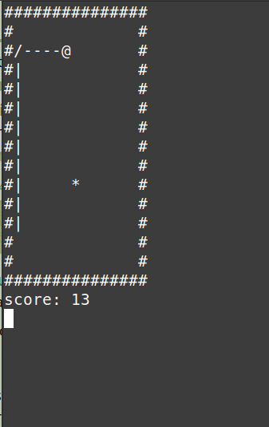
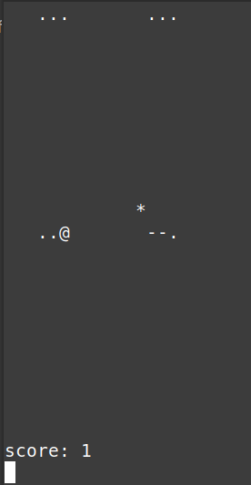

# Console snake

## Installing

`make`

## Playing

`./snake`

## Controls

wasd

## Options

`./snake <tick length in milliseconds (default 400)> <--transparent | something else> <width> <height>`

## Examples

